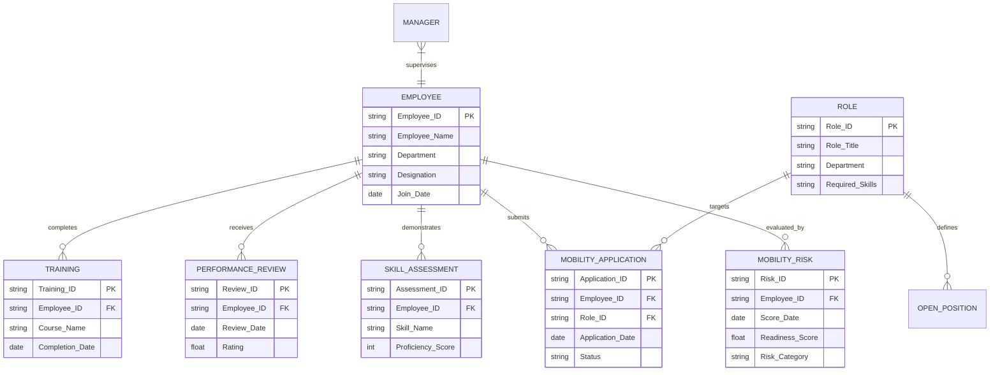

# Day 1 Deliverable: Relational Schema Diagram

```mermaid
erDiagram
    EMPLOYEE ||--o{ TRAINING : completes
    EMPLOYEE ||--o{ PERFORMANCE_REVIEW : receives
    EMPLOYEE ||--o{ SKILL_ASSESSMENT : demonstrates
    EMPLOYEE ||--o{ MOBILITY_APPLICATION : submits
    EMPLOYEE ||--o{ MOBILITY_RISK : evaluated_by
    ROLE ||--o{ MOBILITY_APPLICATION : targets
    ROLE ||--o{ OPEN_POSITION : defines
    MANAGER }|--|| EMPLOYEE : supervises

    EMPLOYEE {
        string Employee_ID PK
        string Employee_Name
        string Department
        string Designation
        date Join_Date
    }

    ROLE {
        string Role_ID PK
        string Role_Title
        string Department
        string Required_Skills
    }

    TRAINING {
        string Training_ID PK
        string Employee_ID FK
        string Course_Name
        date Completion_Date
    }

    PERFORMANCE_REVIEW {
        string Review_ID PK
        string Employee_ID FK
        date Review_Date
        float Rating
    }

    SKILL_ASSESSMENT {
        string Assessment_ID PK
        string Employee_ID FK
        string Skill_Name
        int Proficiency_Score
    }

    MOBILITY_APPLICATION {
        string Application_ID PK
        string Employee_ID FK
        string Role_ID FK
        date Application_Date
        string Status
    }

    MOBILITY_RISK {
        string Risk_ID PK
        string Employee_ID FK
        date Score_Date
        float Readiness_Score
        string Risk_Category
    }
```
